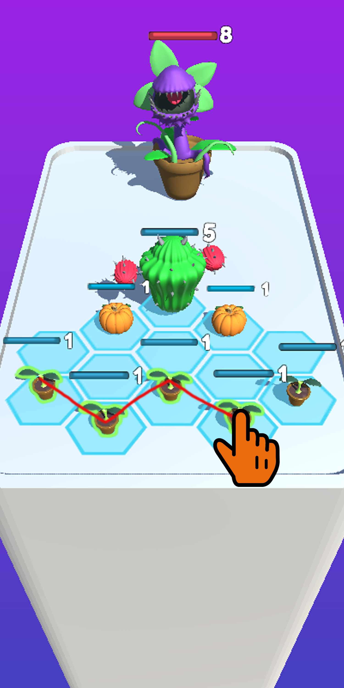
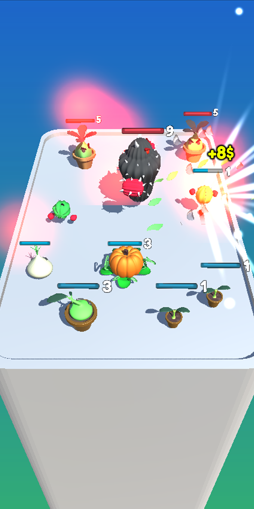
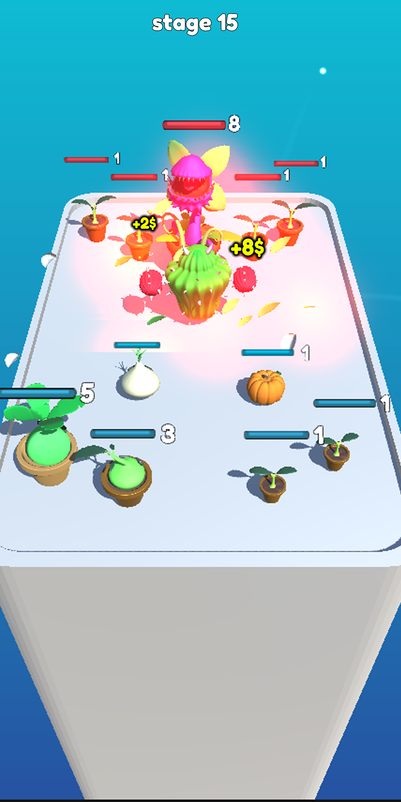
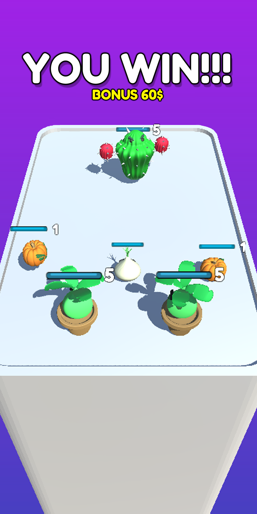
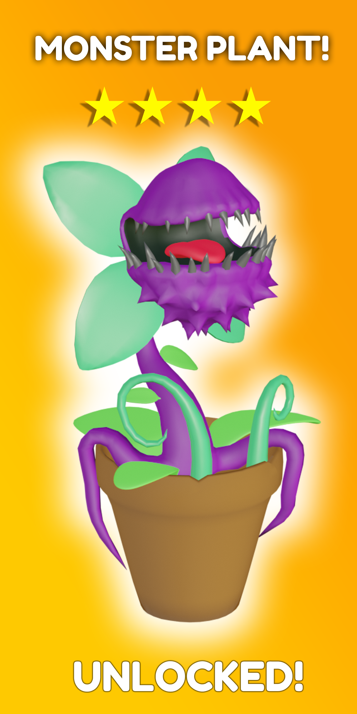
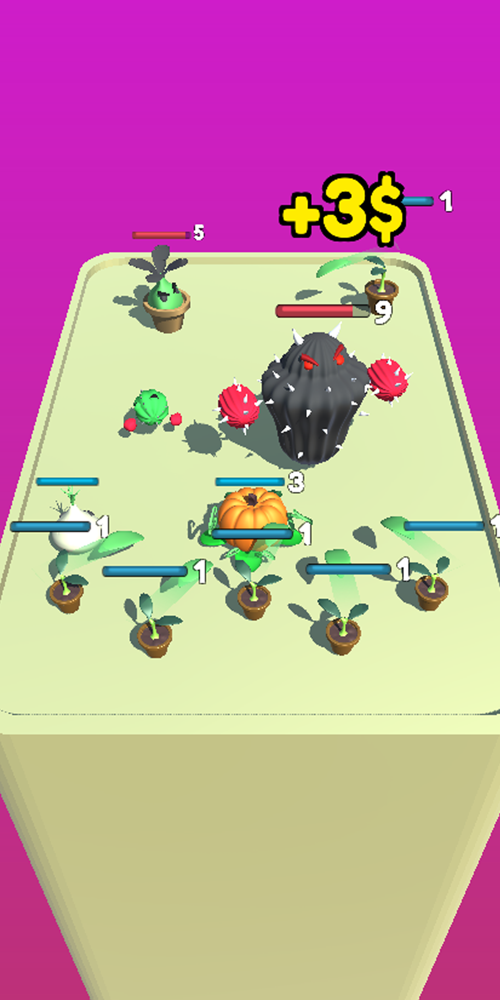

# Merge-Plants

Google Play link: https://play.google.com/store/apps/details?id=com.swipestudios.mergeplants

Game Desctiption:

Merge Plants is simple android game wiht  a thrilling journey of merging, evolving, and battling with plants. Your objective is to create the strongest and most powerful plants by merging them, unlocking new ones, and evolving them to their full potential.
As you progress through the game, you'll encounter various enemies that pose a threat to your plants. You'll need to strategize and use your plant's unique abilities to defeat these foes and emerge victorious.
Merge Plants offers a unique and immersive gaming experience with its stunning visuals and engaging gameplay. With over 10 of plants to collect and evolve, you'll never run out of things to do in this game. Whether you're a casual player or a hardcore gamer, Merge Plants is the perfect game for you.

Gameplay images:

 

